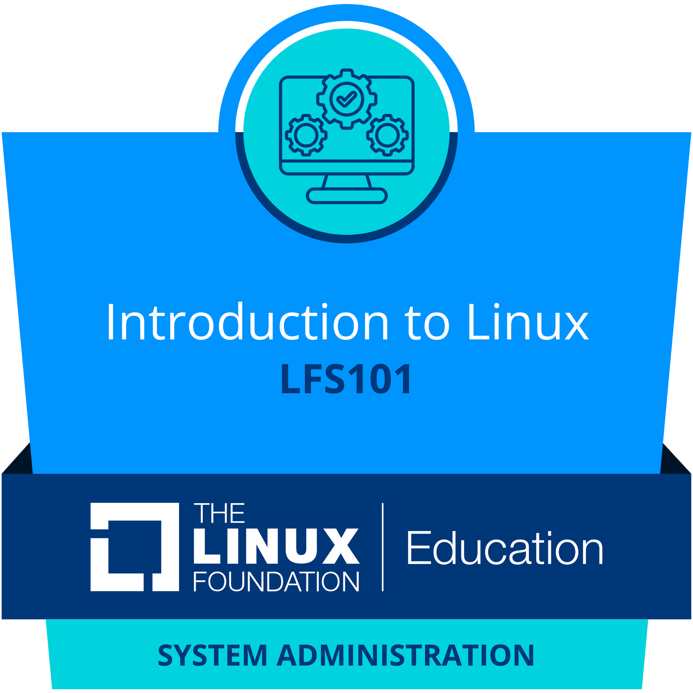
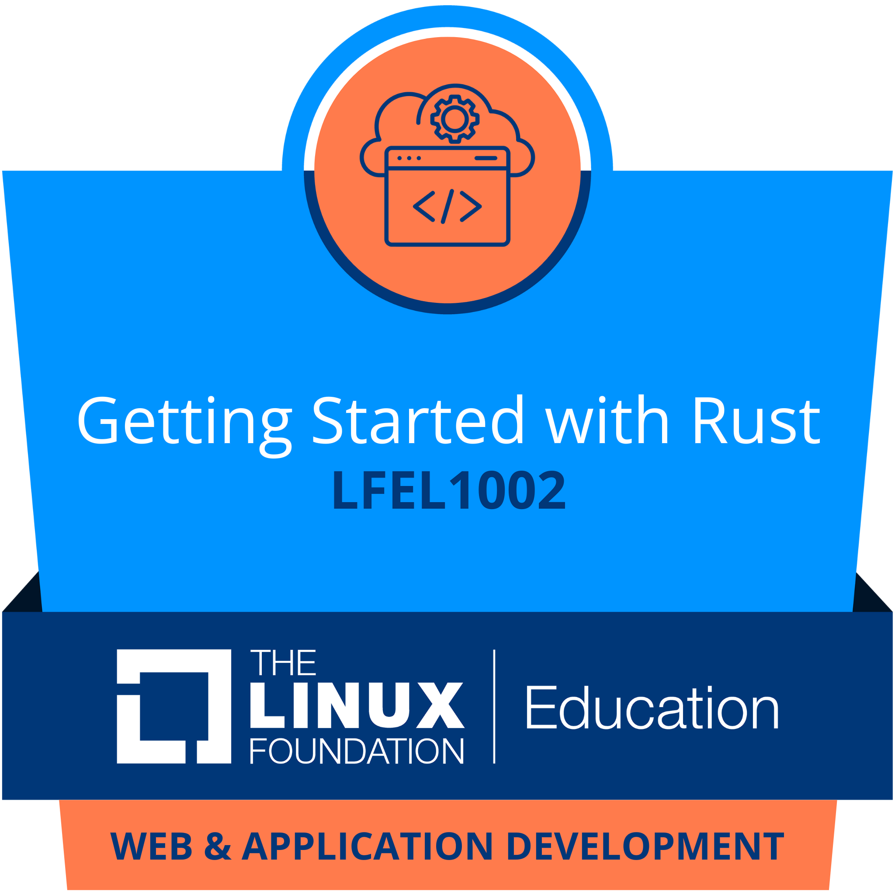

## 🦀 About Me

I'm Parsa, an amatuer "Electrical Engineer" like to build stuffs, whether be a hardware or software. Seeking for solving problems, from software level to fundamental level.

## 💡 Interests

- **🐧 Kernel Development Enthusiast** - Exploring the inner workings of operating systems
- **⚡ Embedded Systems & Circuit Desing** - Building projects with microcontrollers and real-time systems
- **🔬 Semiconductors** - Understanding the physics and design of electronic components
- **⚛️ Quantum Computing & Information** - Diving into quantum algorithms and information theory

## 🛠️ Tech Stack
### ⚙️ Primary Tools

### 🪛 Secondary Tools

> 🔩 Other Tools
> 
> 
> 
> 

## 💻 Machines

## ✏️ Editors

## 🏆 Certifide Badges

<table align="center">
<tr> 
    <th>
      
    </th>
    <th>
      
    </th>
    <th>
      
    </th>
</tr>  
</table>

*Click the badge to open certificate*

## 📫 Let's Connect

Feel free to reach out if you want to collaborate on projects or just chat about tech!

---

